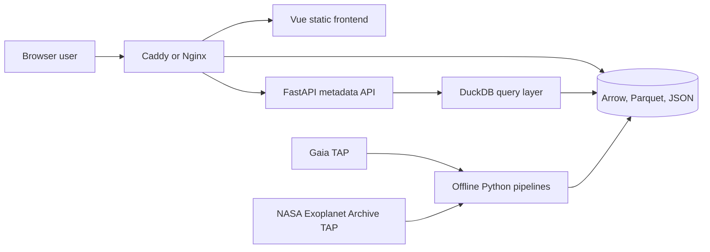
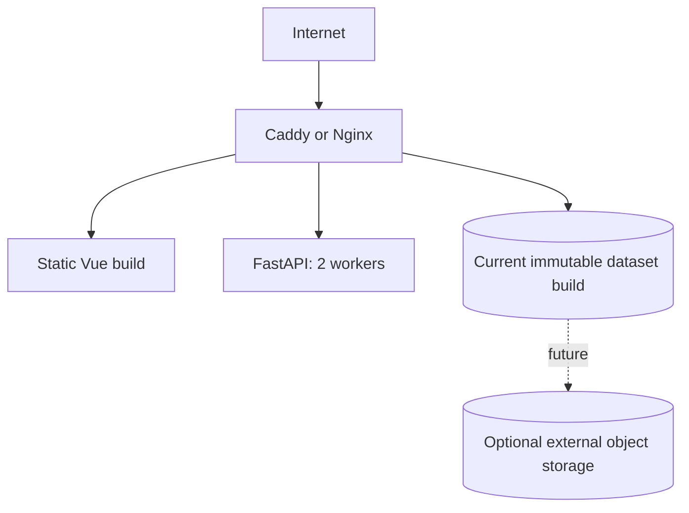

# Architecture

## 1. Purpose

This document defines the architecture for the fresh Milky Way & Exoplanet Explorer project.

The system is designed around four realities:

1. Gaia DR3 is far too large to download, store, or render in full on the current server.
2. A top-down Galactic reconstruction requires distance estimates and careful quality handling.
3. Familiar star names exist for only a small, strongly selected subset of stars.
4. The production server has 4 vCPU, 8 GB RAM, and 80 GB local disk.

The architecture therefore separates:

- aggregated Galactic context;
- individually selectable named objects;
- detailed metadata loaded only when required.

## 2. Architectural principles

### 2.1 Exoplanet-first object selection

The NASA Exoplanet Archive is ingested before Gaia host enrichment.

It provides:

- confirmed planets;
- readable host names;
- Gaia DR3 identifiers where available;
- orbital and stellar metadata.

The resulting Gaia IDs are then used to request exact Gaia source records.

### 2.2 Gaia is an ingestion source, not a live frontend backend

The browser never calls Gaia directly.

Gaia queries are performed by offline or scheduled Python jobs. Successful outputs are persisted and versioned.

### 2.3 Aggregate first, detail later

The global Milky Way view uses density cells rather than individual stars.

Individual source records are reserved for:

- exoplanet hosts;
- named or curated stars;
- search results;
- high-zoom regional exploration.

### 2.4 Compact browser payloads

Global render files contain only numeric attributes and stable identifiers.

Variable-length names and complete scientific metadata are stored separately.

### 2.5 Precompute expensive transformations

The following operations happen offline:

- ID normalization;
- Gaia–exoplanet cross-matching;
- distance-method selection;
- coordinate transforms;
- Galactocentric positions;
- density aggregation;
- display colour and size calculations;
- quality flags;
- search indexes;
- Arrow file generation.

### 2.6 Immutable data builds

Every public dataset build has:

- source release or snapshot;
- query text;
- query job IDs;
- checksums;
- row counts;
- transformation version;
- build ID;
- generated file list.

## 3. System context



## 4. Logical components

### 4.1 Frontend application

#### Current prototype (implemented)

Responsibilities:

- load `exoplanet_hosts.arrow` from the configured data base URL;
- validate Arrow rows into typed host visualization records;
- project heliocentric and Galactocentric positions with an equal physical scale;
- render an interactive SVG scatter plot of exoplanet hosts.

Module boundaries:

```text
domain/          scientific types, coordinates, frame definitions
data/            Arrow transport and validation
visualization/   pure D3 plot-model construction
components/      Vue SVG presentation and interaction state
```

Dependency direction: components and App depend on data + visualization +
domain; visualization and data depend on domain; domain has no UI or transport
dependencies.

Current stack:

- Vue 3;
- TypeScript;
- Vite;
- Tailwind CSS;
- D3 (scales, ticks, projection only);
- Apache Arrow JavaScript;
- Vue-managed SVG rendering.

There is no router, global store, API client, or WebGL renderer in the current
package. See [../frontend/README.md](../frontend/README.md).

#### Target MVP (planned)

Responsibilities:

- render Galactic density layers;
- render named and exoplanet-host markers;
- maintain camera and projection state;
- animate transitions;
- perform GPU picking;
- load metadata after selection;
- search hosts and planets;
- expose quality and provenance labels.

Planned stack additions:

- deck.gl / WebGL rendering;
- Motion for Vue (or equivalent transition layer);
- metadata and search API client.

### 4.2 FastAPI service

Responsibilities:

- health and build-status endpoints;
- source and system detail endpoints;
- planet and host search;
- dataset manifests;
- small filtered queries;
- optional signed or redirected static-file responses.

The API should not parse the entire render catalogue at startup.

### 4.3 Exoplanet ingestion pipeline

Responsibilities:

- query `PSCompPars` into a versioned raw snapshot;
- load and validate staging rows without dropping failures silently;
- publish `exoplanets`, `exoplanet_hosts`, and `exoplanet_systems` Parquet tables;
- assign stable `nea:{kind}:{search_key}` identifiers;
- select deterministic host stellar properties when planet rows conflict;
- group provisional systems by exact host name;
- write review sinks for invalid rows, stellar conflicts, and archive planet-count mismatches;
- expose host `gaia_source_id` values for later exact Gaia enrichment.

### 4.4 Gaia host-enrichment pipeline

Implemented responsibilities:

- query exact Gaia DR3 source IDs in deterministic batches;
- retrieve only the required columns;
- publish a failure-safe committed multi-file snapshot;
- combine and validate all batches;
- retain distance provenance;
- calculate heliocentric Cartesian positions (parsecs);
- calculate Galactocentric Cartesian positions (kiloparsecs, Astropy `v4.0`);
- publish `gaia_host_sources.parquet`.

Future responsibilities:

- create compact render records;
- add reviewed fallback matching where an exact Gaia ID is unavailable.

### 4.5 Gaia background pipeline

Responsibilities:

- retrieve manageable Gaia chunks;
- transform sources into Galactocentric coordinates;
- aggregate sources into density cells;
- discard unnecessary source-level temporary data after a successful build;
- produce several grid resolutions if useful.

The first implementation may use the existing 10,000-source sample. It is a pipeline-validation dataset, not the final density model.

### 4.6 Metadata repository

DuckDB queries Parquet directly.

Primary tables:

```text
exoplanet_hosts
exoplanet_systems
exoplanets
gaia_host_sources
named_sources
gaia_density_cells
dataset_builds
```

Review tables remain analytical side channels (`review_*`) and are not required for the public API.

### 4.7 Static data delivery

Static files should be served by Caddy or Nginx instead of FastAPI when possible.

Examples:

```text
/data/builds/{build_id}/milky-way-density.arrow
/data/builds/{build_id}/exoplanet_hosts.arrow
/data/builds/{build_id}/manifest.json
```

In local development the current host artifact is also served directly by
FastAPI at `/data/exoplanet_hosts.arrow` from `data/frontend/`.

## 5. Runtime request model

### Current prototype

```text
GET /data/exoplanet_hosts.arrow
```

### Target MVP — initial page load

```text
GET /data/current/manifest.json
GET /data/current/milky-way-density.arrow
GET /data/current/exoplanet_hosts.arrow
```

### Target MVP — object selection

```text
GET /api/v1/sources/{gaia_source_id}
GET /api/v1/systems/{host_id}
```

### Target MVP — search

```text
GET /api/v1/search?q=TRAPPIST-1
```

### Target MVP — planet details

```text
GET /api/v1/planets/{planet_id}
```

## 6. Rendering architecture

### Current prototype

The implemented host view is a Vue-managed SVG scatter plot. D3 builds a pure
plot model (equal physical scale, ticks, reference points, planet-count radii);
the component renders circles and frame controls. Hosts without positions for
the selected frame are retained in the dataset but omitted from the plot.

### Target MVP layers

The public renderer is planned to use separate WebGL / deck.gl layers:

```text
DensityLayer
    Gaia-derived Galactic context

HostStarLayer
    Individually selectable exoplanet hosts

NamedStarLabelLayer
    Labels visible according to zoom and priority

SelectionLayer
    Selected-source highlight

ReferenceLayer
    Galactic centre, Sun, scale rings, axes
```

The background and host layers can be updated independently.

## 7. Coordinate systems

### 7.1 Observed sky

- ICRS: right ascension and declination;
- Galactic: longitude `l` and latitude `b`.

### 7.2 Heliocentric top-down

The Sun is the origin. Exact host sources store `heliocentric_{x,y,z}_pc`
derived from Galactic `(l, b)` and the selected distance. This is useful for
the exoplanet atlas.

### 7.3 Galactocentric top-down

The Galactic centre is the origin. Exact host sources store
`galactocentric_{x,y,z}_kpc` via Astropy's named `v4.0` Galactocentric
parameter set. This is the main Milky Way overview.

The pipeline must explicitly freeze and record that parameter set so library
upgrades do not silently change positions.

## 8. Name architecture

The render file does not repeat full names for every row.

Use:

```text
host render record
    source_id
    name_index
    numeric render attributes

name table
    name_index
    display_name
    source catalogue
    aliases
```

Display-name priority for the MVP:

1. NASA host name;
2. HD name;
3. HIP name;
4. Gaia DR3 designation.

## 9. Server-aware constraints

### CPU

Four vCPUs are sufficient for:

- static file serving;
- a small FastAPI service;
- DuckDB lookups;
- moderate scheduled processing.

Large ingestion and aggregation jobs should not run concurrently with high public traffic.

### RAM

Eight GB is sufficient only if:

- pipelines use lazy, streaming, or batch processing;
- Arrow and Parquet are not fully duplicated in memory;
- FastAPI does not preload all source data;
- worker count remains conservative.

Recommended initial API worker count: 2.

### Disk

The 80 GB disk must not accumulate:

- multiple raw Gaia builds;
- uncompressed duplicate exports;
- old Docker layers;
- unlimited logs;
- abandoned TAP downloads.

A future attached volume or object store is required before storing a large multi-resolution Gaia tile pyramid.

## 10. Deployment topology



## 11. Scalability path

### Prototype

- 10,000-source Gaia validation sample;
- complete exoplanet catalogue;
- exact Gaia records for matched hosts;
- one coarse density grid.

### Public MVP

- chunked Gaia background ingestion;
- multiple density resolutions;
- complete matched host layer;
- compact Arrow delivery;
- GitHub Actions deployment.

### Later

- external object storage;
- regional high-zoom source tiles;
- additional named-star enrichment;
- more complete density builds;
- Gaia DR4 migration plan.
