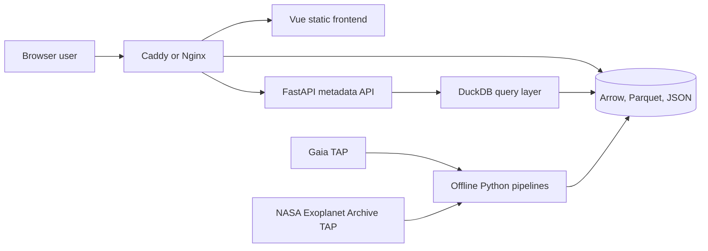
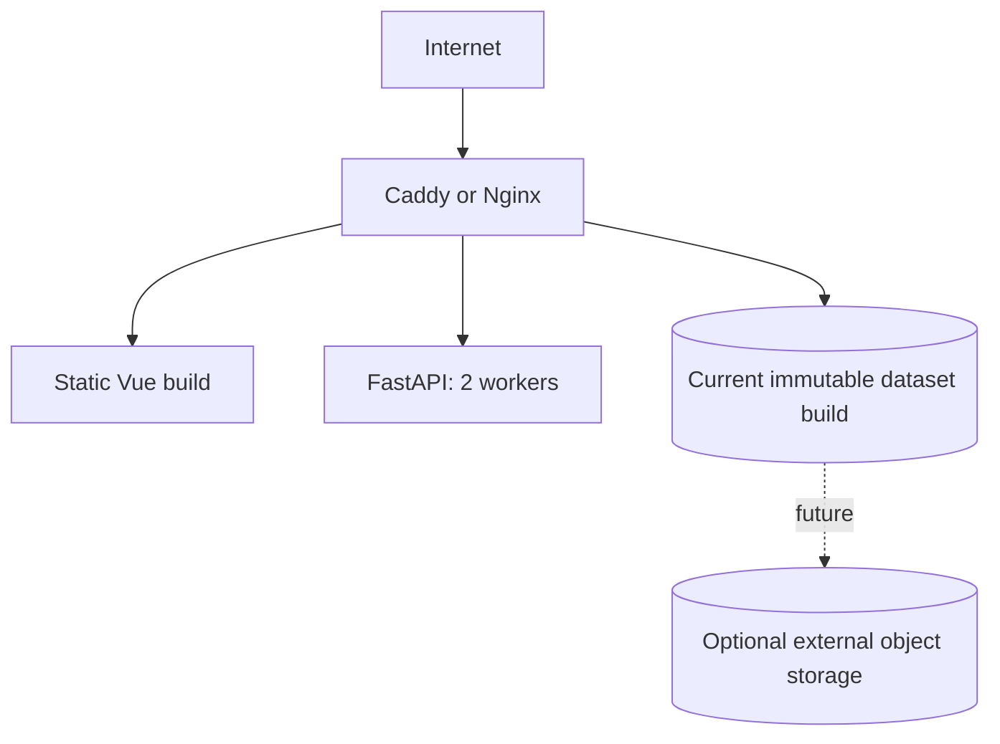

# Architecture

## 1. Purpose

This document defines the architecture for the fresh Milky Way & Exoplanet Explorer project.

The system is designed around four realities:

1. Gaia DR3 is far too large to download, store, or render in full on a modest production host.
2. A top-down Galactic reconstruction requires distance estimates and careful quality handling.
3. Familiar star names exist for only a small, strongly selected subset of stars.
4. A representative target deployment has 4 vCPU, 8 GB RAM, and 80 GB local disk.

The architecture therefore separates:

- aggregated Galactic context;
- individually selectable named objects;
- detailed metadata loaded only when required.

## 2. Architectural principles

### 2.1 Exoplanet-first object selection

The NASA Exoplanet Archive is ingested before Gaia host enrichment.

It provides:

- confirmed planets;
- readable host names;
- Gaia DR3 identifiers where available;
- orbital and stellar metadata.

The resulting Gaia IDs are then used to request exact Gaia source records.

### 2.2 Gaia is an ingestion source, not a live frontend backend

The browser never calls Gaia directly.

Gaia queries are performed by offline or scheduled Python jobs. Successful outputs are persisted and versioned.

### 2.3 Aggregate first, detail later

The global Milky Way view uses density cells rather than individual stars.

Individual source records are reserved for:

- exoplanet hosts;
- named or curated stars;
- search results;
- high-zoom regional exploration.

### 2.4 Compact browser payloads

Global render files contain only numeric attributes and stable identifiers.

Variable-length names and complete scientific metadata are stored separately.

### 2.5 Precompute expensive transformations

The following operations happen offline:

- ID normalization;
- Gaia–exoplanet cross-matching;
- distance-method selection;
- coordinate transforms;
- Galactocentric positions;
- density aggregation;
- display colour and size calculations;
- quality flags;
- search indexes;
- Arrow file generation.

### 2.6 Immutable data builds

The implemented v1 manifest records the build identity, source-snapshot
checksums, and artifact checksums, sizes, and row counts. Query text, Gaia job
IDs, transformation versions, and the Galactocentric parameter set remain
planned provenance fields.

## 3. System context



## 4. Logical components

### 4.1 Frontend application

#### Current prototype (implemented)

Responsibilities:

- load `milky-way-density.arrow` and `exoplanet_hosts.arrow` from the
  configured data base URL (both required);
- validate Arrow rows into typed density and host visualization records;
- project heliocentric and Galactocentric host positions with an equal
  physical scale;
- render side-by-side SVG plots: Gaia density grid and exoplanet-host scatter.

Module boundaries:

```text
domain/          scientific types, coordinates, frame definitions
data/            Arrow transport and validation (host + density)
visualization/   pure D3 plot-model construction
components/      Vue SVG presentation and interaction state
```

Dependency direction: components and App depend on data + visualization +
domain; visualization and data depend on domain; domain has no UI or transport
dependencies.

Current stack:

- Vue 3;
- TypeScript;
- Vite;
- Tailwind CSS;
- D3 (scales, ticks, projection only);
- Apache Arrow JavaScript;
- Vue-managed SVG rendering.

There is no router, global store, API client, or WebGL renderer in the current
package. See [../frontend/README.md](../frontend/README.md).

#### Target MVP (planned)

Responsibilities:

- render Galactic density layers with WebGL / deck.gl;
- render named and exoplanet-host markers;
- maintain camera and projection state;
- animate transitions;
- perform GPU picking;
- load metadata after selection;
- search hosts and planets from the UI;
- expose quality and provenance labels.

Planned stack additions:

- deck.gl / WebGL rendering;
- Motion for Vue (or equivalent transition layer);
- metadata and search API client.

### 4.2 FastAPI service

Implemented responsibilities:

- health and build-status endpoints;
- star / alias search over published identity Parquet (`GET /api/v1/search`);
- allowlisted Arrow file responses from the active immutable build
  (`/data/exoplanet_hosts.arrow`, `/data/milky-way-density.arrow`).

Planned responsibilities:

- source, system, and planet detail endpoints;
- exoplanet / planet name search beyond the identity catalogue;
- optional signed or redirected static-file responses behind a reverse proxy.

The API should not parse the entire render catalogue at startup.

### 4.3 Exoplanet ingestion pipeline

Responsibilities:

- query `PSCompPars` into a versioned raw snapshot;
- load and validate staging rows without dropping failures silently;
- publish `exoplanets`, `exoplanet_hosts`, and `exoplanet_systems` Parquet tables;
- assign stable `nea:{kind}:{search_key}` identifiers;
- select deterministic host stellar properties when planet rows conflict;
- group provisional systems by exact host name;
- write review sinks for invalid rows, stellar conflicts, and archive planet-count mismatches;
- expose host `gaia_source_id` values for later exact Gaia enrichment.

### 4.4 Gaia host-enrichment pipeline

Implemented responsibilities:

- query exact Gaia DR3 source IDs in deterministic batches;
- retrieve only the required columns;
- publish a failure-safe committed multi-file snapshot;
- combine and validate all batches;
- retain distance provenance;
- calculate heliocentric Cartesian positions (parsecs);
- calculate Galactocentric Cartesian positions (kiloparsecs, Astropy `v4.0`);
- publish `gaia_host_sources.parquet`.

Future responsibilities:

- create compact render records;
- add reviewed fallback matching where an exact Gaia ID is unavailable.

### 4.5 Gaia background pipeline

Implemented responsibilities:

- retrieve manageable Gaia chunks via `refresh-gaia-background`
  (default: 5,000,000 `random_index` candidates in 100,000-row CSV batches);
- transform accepted sources into Galactocentric coordinates;
- aggregate sources into density cells (`build-gaia-density`);
- write `gaia_density_cells.parquet` and `frontend/milky-way-density.arrow`;
- discard unnecessary source-level temporary data after a successful build.
- classify candidate distances into baseline, exploratory, and unavailable tiers;
- aggregate baseline and exploratory sources separately so their statistics remain 
 independently renderable;

The pipeline may produce several grid resolutions later; the current default is
a single 128 × 128 grid over a ±20 kpc Galactocentric extent. Commands and
snapshot policy: [../pipelines/README.md](../pipelines/README.md).

### 4.6 Metadata repository

DuckDB queries Parquet directly from the **published** build.

Primary tables used today:

```text
stars                  # identity catalogue (search)
alias                  # identity aliases (search)
exoplanet_hosts
exoplanet_systems
exoplanets
gaia_host_sources
gaia_density_cells
exoplanet_host_links
```

Only `stars.parquet` and `alias.parquet` are copied into the immutable release
allowlist for search. Review tables remain analytical side channels
(`review_*`) and are not required for the public API.

### 4.7 Release publication

Mutable pipeline outputs under `data/processed/` and `data/frontend/` are not
served directly. `publish-release` copies the release allowlist into
`data/builds/{build_id}/`, writes `manifest.json`, and atomically updates
`data/builds/current.json`. See [DEPLOYMENT.md](DEPLOYMENT.md).

### 4.8 Static data delivery

Static files should be served by Caddy or Nginx instead of FastAPI when
possible (production target). The future reverse-proxy URL contract for active
and build-addressed artifacts is not decided yet.

In local development FastAPI resolves `data/builds/current.json` and serves
allowlisted Arrow files from that build at:

```text
GET /data/exoplanet_hosts.arrow
GET /data/milky-way-density.arrow
```

## 5. Runtime request model

### Current prototype

```text
GET /api/v1/health
GET /api/v1/build
GET /api/v1/search?q=TRAPPIST-1
GET /data/exoplanet_hosts.arrow
GET /data/milky-way-density.arrow
```

`/api/v1/search` queries IAU stars and aliases from the published build. The
Vue prototype does not call it yet.

### Target MVP — initial page load

The future reverse-proxy URL contract for manifests and immutable artifacts is
undecided. For build metadata and visualization artifacts, the supported
contract remains `GET /api/v1/build` and `GET /data/<artifact>`.

### Target MVP — object selection

```text
GET /api/v1/sources/{gaia_source_id}
GET /api/v1/systems/{host_id}
```

### Target MVP — planet details

```text
GET /api/v1/planets/{planet_id}
```

## 6. Rendering architecture

### Current prototype

The implemented views are Vue-managed SVG plots: a Gaia density-grid panel and
an exoplanet-host scatter panel. D3 builds pure plot models (equal physical
scale, ticks, reference points, cell geometry, planet-count radii); components
render shapes and frame controls. Hosts without positions for the selected
frame are retained in the dataset but omitted from the host plot.

### Target MVP layers

The public renderer is planned to use separate WebGL / deck.gl layers:

```text
DensityLayer
    Gaia-derived Galactic context

HostStarLayer
    Individually selectable exoplanet hosts

NamedStarLabelLayer
    Labels visible according to zoom and priority

SelectionLayer
    Selected-source highlight

ReferenceLayer
    Galactic centre, Sun, scale rings, axes
```

The background and host layers can be updated independently.

## 7. Coordinate systems

### 7.1 Observed sky

- ICRS: right ascension and declination;
- Galactic: longitude `l` and latitude `b`.

### 7.2 Heliocentric top-down

The Sun is the origin. Exact host sources store `heliocentric_{x,y,z}_pc`
derived from Galactic `(l, b)` and the selected distance. This is useful for
the exoplanet atlas.

### 7.3 Galactocentric top-down

The Galactic centre is the origin. Exact host sources store
`galactocentric_{x,y,z}_kpc` via Astropy's named `v4.0` Galactocentric
parameter set. This is the main Milky Way overview.

The pipeline must explicitly freeze and record that parameter set so library
upgrades do not silently change positions.

## 8. Name architecture

The current host Arrow file stores `host_name` directly on each record. A
separate indexed name table remains planned for larger render datasets.

Planned shape:

```text
host render record
    source_id
    name_index
    numeric render attributes

name table
    name_index
    display_name
    source catalogue
    aliases
```

Display-name priority for the MVP:

1. NASA host name;
2. HD name;
3. HIP name;
4. Gaia DR3 designation.

## 9. Server-aware constraints

### CPU

Four vCPUs are sufficient for:

- static file serving;
- a small FastAPI service;
- DuckDB lookups;
- moderate scheduled processing.

Large ingestion and aggregation jobs should not run concurrently with high public traffic.

### RAM

Eight GB is sufficient only if:

- pipelines use lazy, streaming, or batch processing;
- Arrow and Parquet are not fully duplicated in memory;
- FastAPI does not preload all source data;
- worker count remains conservative.

Recommended initial API worker count: 2.

### Disk

The 80 GB disk must not accumulate:

- multiple raw Gaia builds;
- uncompressed duplicate exports;
- old Docker layers;
- unlimited logs;
- abandoned TAP downloads.

A future attached volume or object store is required before storing a large multi-resolution Gaia tile pyramid.

## 10. Deployment topology

Planned production layout (not implemented in-repo yet — no Docker, Compose, or
deploy workflow). Local release and serving: [DEPLOYMENT.md](DEPLOYMENT.md).



## 11. Scalability path

### Prototype (current)

- chunked Gaia background sample (5M `random_index` candidates);
- complete exoplanet catalogue;
- exact Gaia records for matched hosts;
- one coarse density grid + dual SVG visualization;
- immutable `publish-release` builds;
- GitHub Actions CI (lint / type / test / frontend build).

### Public MVP

- multiple density resolutions;
- WebGL / deck.gl rendering;
- UI search and detail panels;
- compact Arrow delivery behind a reverse proxy;
- GitHub Actions SSH deployment.

### Later

- external object storage;
- regional high-zoom source tiles;
- additional named-star enrichment;
- more complete density builds;
- Gaia DR4 migration plan.
