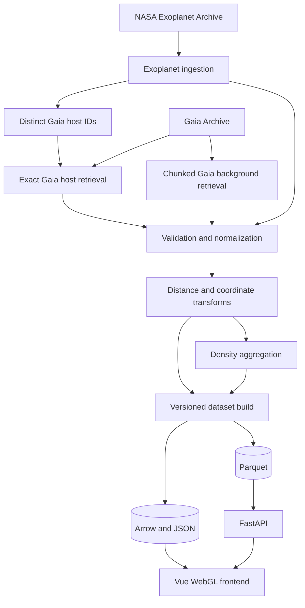
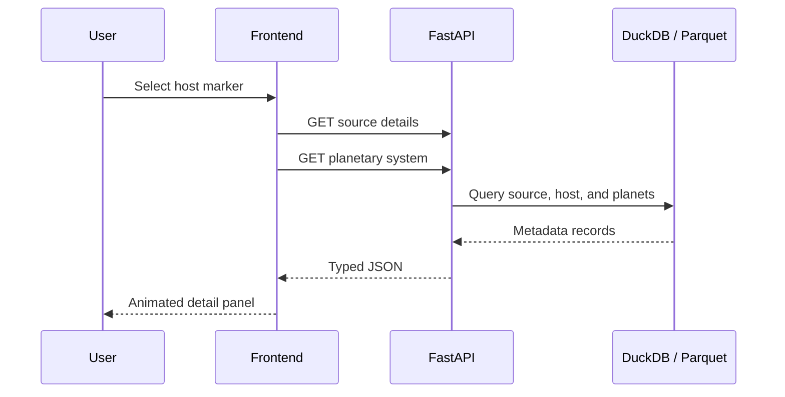

# Data Flow

## 1. Overview

The system separates upstream catalogue access, offline transformation, static publication, and runtime metadata queries.



## 2. Exoplanet-first ingestion

The canonical build consumes a committed NASA `PSCompPars` snapshot. Retrieval
is an explicit maintainer action and is not part of the normal build.

### 2.1 Raw snapshot refresh

A maintainer refreshes the snapshot with:

```text
python -m app.main refresh-pscomppars
    → NASA TAP query
    → data/raw/nasa_pscomppars/current/pscomppars.csv
    → data/raw/nasa_pscomppars/current/snapshot.json
```

### 2.2 Staging and domain publication

The committed CSV snapshot is loaded into a validated staging frame, then split into published domain tables. Invalid staging rows are never dropped silently.

```text
data/raw/nasa_pscomppars/current/pscomppars.csv
    → staging (is_valid, normalized names, gaia_source_id)
    → exoplanets.parquet
    → exoplanet_hosts.parquet
    → exoplanet_systems.parquet
    → review_invalid_exoplanet_rows.parquet
    → review_host_stellar_conflicts.parquet
    → review_system_planet_count_mismatches.parquet
```

Entity IDs are stable search keys with a NASA prefix:

```text
nea:planet:<search_key(planet_name)>
nea:host:<search_key(host_name)>
nea:system:<search_key(host_name)>
```

For the current snapshot the expectations are 6336 planets, 4749 hosts, and 4749 provisional systems.

#### Planet

One row per valid staging planet. Each planet references both `host_id` and `system_id`.

```text
planet_id
system_id
host_id
planet_name
planet_letter
radius_earth
mass_earth
mass_provenance
density_g_cm3
equilibrium_temperature_k
insolation_earth
orbital_period_days
semi_major_axis_au
eccentricity
inclination_deg
discovery_method
discovery_year
discovery_facility
is_controversial
source
```

#### Host

One deterministic host per exact `host_name`. When multiple planet rows carry different stellar values, the pipeline keeps the row with the most complete stellar fields, breaking ties by ascending `planet_name` (`most_complete_then_planet_name`). Conflicting candidates stay in the review sink.

```text
host_id
host_name
hd_name
hip_name
tic_id
gaia_dr3_designation
gaia_source_id
ra_deg
dec_deg
system_distance_pc
star_count
planet_count
is_circumbinary
stellar_temperature_k
stellar_mass_solar
stellar_radius_solar
stellar_luminosity_log_solar
stellar_fields_available
stellar_source_planet_name
stellar_selection_method
stellar_values_conflict
source
```

#### System

One provisional system per exact host name (`system_grouping_method = exact_host_name`). `planet_count` is recomputed from published planet rows; NASA's archive `sy_pnum` is retained as `archive_planet_count` for audit.

```text
system_id
host_id
host_name
star_count
planet_count
archive_planet_count
planet_count_matches_archive
system_distance_pc
is_circumbinary
system_grouping_method
source
```

#### Review sinks

| File | Reason |
|---|---|
| `review_invalid_exoplanet_rows.parquet` | Staging rows that failed identity, coordinate, system-count, or Gaia-ID validation |
| `review_host_stellar_conflicts.parquet` | Every stellar candidate for hosts where planet rows disagree |
| `review_system_planet_count_mismatches.parquet` | Exact-host planet counts that differ from NASA `sy_pnum` (for example broader systems split across exact host labels such as `55 Cnc` / `55 Cnc B`) |

Current snapshot expectations: 0 invalid rows, 596 stellar-conflict candidate rows (211 hosts), and 14 system count mismatches.

### 2.3 Host Gaia-ID extraction

The canonical build extracts the distinct, non-null Gaia IDs from the published
host table:

```text
exoplanet_hosts.parquet
    → filter non-null gaia_source_id
    → deduplicate and sort by gaia_source_id
    → gaia_host_ids.parquet
```

## 3. Exact Gaia host retrieval

Exact host enrichment is split into a maintainer-only refresh and an offline
canonical publish step. The current manifest contains 4,396 distinct Gaia DR3
source IDs.

### 3.1 Maintainer refresh

`python -m app.main refresh-gaia-hosts` divides the committed ID manifest into
batches of 500 and submits asynchronous Gaia TAP jobs with direct CSV output.
All batches are written to a temporary staging directory, then promoted as one
failure-safe multi-file snapshot.

```text
gaia_host_ids.parquet
    → 9 deterministic batches (500 IDs each; last batch smaller)
    → Gaia asynchronous TAP jobs (CSV)
    → temporary staging directory
    → data/raw/gaia_hosts/current/
         batches/gaia-host-0001.csv … gaia-host-0009.csv
         snapshot.json   # tree checksum + per-file digests
```

Each batch queries only the required Gaia columns. Interrupted refreshes never
leave a half-written `current/` directory for the build to read.

### 3.2 Canonical publish

The normal build consumes the committed snapshot and does not contact Gaia:

```text
data/raw/gaia_hosts/current/
    → combine and validate all batch CSVs
    → select distance with explicit method and quality
    → gaia_host_sources.parquet
```

Current expectations: 4,396 published sources, of which 109 have
`distance_method = unavailable`.

Fallback matching (external identifiers, coordinate matches) is not part of
this flow. Hosts without an exact Gaia ID remain on the NASA host table until a
reviewed fallback path is added.

## 4. Gaia background retrieval

The background pipeline does not need readable names or full source details.

Its purpose is to create density cells for the Milky Way overview.

### 4.1 Initial validation input

Use the already successful 10,000-source retrieval to validate:

- FITS/CSV parsing;
- null handling;
- distance selection;
- Galactocentric transforms;
- density binning;
- Arrow export;
- frontend appearance.

### 4.2 Production retrieval

Larger Gaia inputs are retrieved through multiple asynchronous jobs rather than one monolithic query.

Possible chunk keys:

- `random_index` intervals;
- `source_id` intervals;
- HEALPix/source-ID prefixes;
- bounded sky regions.

Each chunk is:

1. submitted asynchronously;
2. downloaded directly to a file;
3. validated;
4. transformed;
5. aggregated;
6. marked complete in a build journal.

The pipeline can resume without repeating successful chunks.

## 5. Validation flow

### Gaia validation

- `source_id` is present;
- coordinates are in valid ranges;
- required rendering values are numeric or null;
- parallax is not silently treated as distance;
- null and NaN values are normalized;
- duplicate source IDs are resolved deterministically;
- source classification and quality fields are preserved.

### Exoplanet validation

- planet and host names are non-empty;
- coordinates are present and within valid RA/Dec ranges;
- archive star and planet counts are at least one;
- Gaia designations either parse to a source ID or are null;
- invalid staging rows go to `review_invalid_exoplanet_rows.parquet`;
- host stellar conflicts and archive planet-count mismatches go to dedicated review sinks;
- published planet foreign keys always resolve to host and system rows.

## 6. Distance selection

The top-down views require distance estimates. Exact Gaia host sources use this
priority:

```text
1. Gaia GSP-Phot distance when distance_gspphot_pc is present and positive
2. inverse positive parallax when parallax_over_error >= 5 and RUWE is null or < 1.4
3. unavailable
```

Every published Gaia host source stores:

```text
distance_pc
distance_lower_pc
distance_upper_pc
distance_method
distance_quality
```

No distance is fabricated for sources that do not meet an accepted method.

## 7. Coordinate transformation

### Heliocentric

Used by the exoplanet atlas.

```text
Sun = origin
x, y = Galactic plane
z = height from Galactic plane
```

### Galactocentric

Used by the Milky Way top-down view.

```text
Galactic centre = origin
Sun = explicit reference marker
```

Astropy performs the transformation. The selected Galactocentric parameter set is written to the dataset manifest.

## 8. Density aggregation

The Gaia background is converted into compact cells.

Example cell schema:

```text
grid_level
cell_x
cell_y
source_count
weighted_brightness
mean_bp_rp
mean_distance_quality
```

The pipeline may produce multiple resolutions:

```text
128 × 128
256 × 256
512 × 512
```

Only non-empty cells are exported.

## 9. Name selection

The initial name policy is:

```text
NASA hostname
    → HD name
    → HIP name
    → Gaia DR3 designation
```

Names are stored in a separate string table and referenced by integer index from the compact render file.

### 9.1 Identity naming catalogues

The offline identity flow also builds a canonical IAU-named star table from the IAU Catalog of Star Names (CSN), WGSN Faints enrichment, and NASA exoplanet host names.

Incomplete CSN rows are not discarded silently. They are written to `data/processed/review_dropped_stars.parquet` for human review. Unmatched exoplanet host names go to the parallel review sink `data/processed/review_unmatched_hosts.parquet` (currently **Mazalaai**).

#### Unurgunite

The current CSN snapshot has 606 rows. Exactly one fails the loader validity checks (non-empty proper name and constellation): **Unurgunite**.

That row is a redirect stub, not a second physical star:

- designation, HIP, Bayer ID, and constellation are empty;
- `origin` is `see Nganurganity`;
- Stanbridge (1857/61) recorded the Boorong name with an English-adapted spelling that dropped the initial *ng-*; WGSN later adopted the corrected form **Nganurganity**.

**Nganurganity** remains the canonical row in `stars.parquet`. Unurgunite is kept only in `review_dropped_stars.parquet` so the historical spelling stays auditable without duplicating the star in search or render tables.

## 10. Build publication

A dataset build is published only after all mandatory validation checks pass.

```text
processed Parquet
    + frontend Arrow files
    + manifest JSON
    + checksums
    → atomic current-build switch
```

The last valid build remains active if a new build fails.

## 11. Runtime frontend flow

### Initial load


### Source selection



## 12. Cache policy

### Browser

- immutable Arrow files cached by build ID;
- selected details cached in memory;
- stale requests aborted;
- old GPU buffers released after view changes.

### Reverse proxy

- long cache lifetime for build-addressed static files;
- no-cache or short cache for `current/manifest.json`;
- compression enabled;
- range requests supported when useful.

### API

- source details may use moderate cache durations;
- search may use short cache durations;
- expensive arbitrary queries are not exposed publicly.

## 13. Failure handling

### Gaia query failure

- persist the Gaia job ID and error;
- retry with bounded backoff;
- reduce batch size if appropriate;
- do not discard successful chunks;
- do not publish a partial build as complete.

### Missing Gaia host record

- keep the exoplanet host;
- use archive coordinates when available;
- mark Gaia enrichment as unavailable;
- retain match status in metadata.

### Missing distance

- include the object in sky-based views;
- exclude it from top-down spatial views;
- disclose the reason.

### Deployment failure

- keep the prior application image and dataset build;
- fail the health check;
- roll back automatically or manually.
