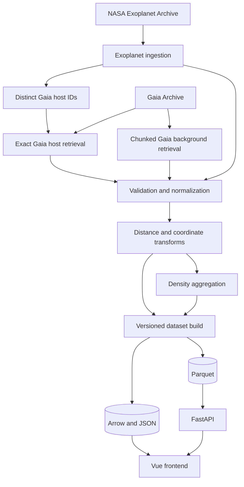
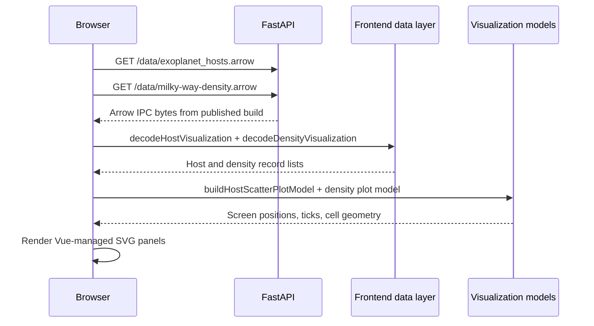
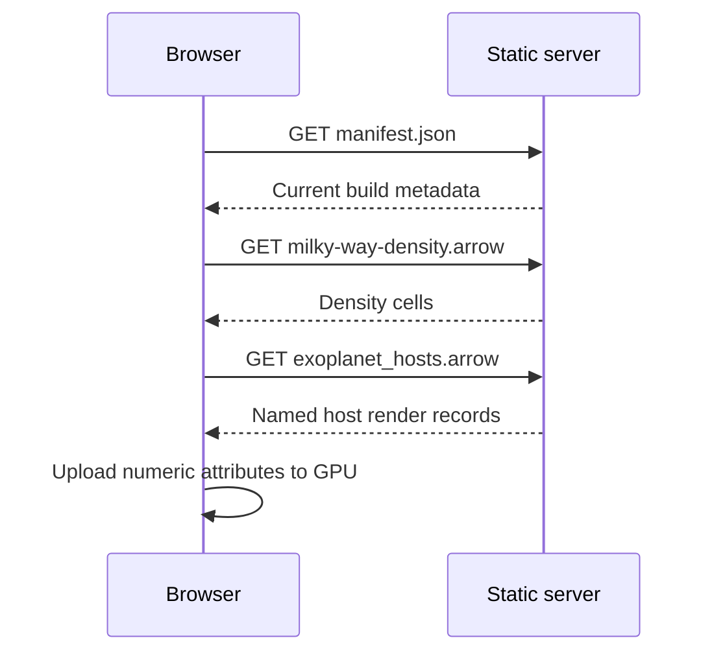
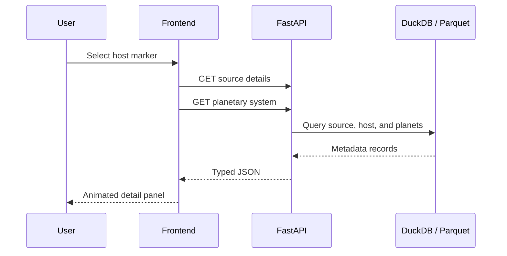

# Data Flow

## 1. Overview

The system separates upstream catalogue access, offline transformation, static publication, and runtime metadata queries.



The current browser prototype is a Vue SVG + D3 dual panel (density grid +
host scatter). WebGL / deck.gl rendering remains the planned public MVP path.

## 2.0 Identity ingestion

The canonical build starts with offline identity resolution from vendored
naming snapshots (`iau_csn`, `wgsn_faints`, `exoplanet_names`):

```text
python -m app.main refresh-snapshots   # maintainer-only
    → data/raw/<source>/current/

canonical build → build-identity
    → stars.parquet
    → alias.parquet
    → exoplanet_host_links.parquet
    → review_dropped_stars.parquet
    → review_unmatched_hosts.parquet
```

These identity tables power star/alias search in the published release.

## 2. Exoplanet-first ingestion

The canonical build consumes a committed NASA `PSCompPars` snapshot. Retrieval
is an explicit maintainer action and is not part of the normal build.

### 2.1 Raw snapshot refresh

A maintainer refreshes the snapshot with:

```text
cd pipelines && uv run python -m app.main refresh-pscomppars
    → NASA TAP query
    → data/raw/nasa_pscomppars/current/pscomppars.csv
    → data/raw/nasa_pscomppars/current/snapshot.json
```

### 2.2 Staging and domain publication

The committed CSV snapshot is loaded into a validated staging frame, then split into published domain tables. Invalid staging rows are never dropped silently.

```text
data/raw/nasa_pscomppars/current/pscomppars.csv
    → staging (is_valid, normalized names, gaia_source_id)
    → exoplanets.parquet
    → exoplanet_hosts.parquet
    → exoplanet_systems.parquet
    → review_invalid_exoplanet_rows.parquet
    → review_host_stellar_conflicts.parquet
    → review_system_planet_count_mismatches.parquet
```

Entity IDs are stable search keys with a NASA prefix:

```text
nea:planet:<search_key(planet_name)>
nea:host:<search_key(host_name)>
nea:system:<search_key(host_name)>
```

For the current snapshot the expectations are 6336 planets, 4749 hosts, and 4749 provisional systems.

#### Planet

One row per valid staging planet. Each planet references both `host_id` and `system_id`.

```text
planet_id
system_id
host_id
planet_name
planet_letter
radius_earth
mass_earth
mass_provenance
density_g_cm3
equilibrium_temperature_k
insolation_earth
orbital_period_days
semi_major_axis_au
eccentricity
inclination_deg
discovery_method
discovery_year
discovery_facility
is_controversial
source
```

#### Host

One deterministic host per exact `host_name`. When multiple planet rows carry different stellar values, the pipeline keeps the row with the most complete stellar fields, breaking ties by ascending `planet_name` (`most_complete_then_planet_name`). Conflicting candidates stay in the review sink.

```text
host_id
host_name
hd_name
hip_name
tic_id
gaia_dr3_designation
gaia_source_id
ra_deg
dec_deg
system_distance_pc
star_count
planet_count
is_circumbinary
stellar_temperature_k
stellar_mass_solar
stellar_radius_solar
stellar_luminosity_log_solar
stellar_fields_available
stellar_source_planet_name
stellar_selection_method
stellar_values_conflict
source
```

#### System

One provisional system per exact host name (`system_grouping_method = exact_host_name`). `planet_count` is recomputed from published planet rows; NASA's archive `sy_pnum` is retained as `archive_planet_count` for audit.

```text
system_id
host_id
host_name
star_count
planet_count
archive_planet_count
planet_count_matches_archive
system_distance_pc
is_circumbinary
system_grouping_method
source
```

#### Review sinks

| File | Reason |
|---|---|
| `review_invalid_exoplanet_rows.parquet` | Staging rows that failed identity, coordinate, system-count, or Gaia-ID validation |
| `review_host_stellar_conflicts.parquet` | Every stellar candidate for hosts where planet rows disagree |
| `review_system_planet_count_mismatches.parquet` | Exact-host planet counts that differ from NASA `sy_pnum` (for example broader systems split across exact host labels such as `55 Cnc` / `55 Cnc B`) |

Current snapshot expectations: 0 invalid rows, 596 stellar-conflict candidate rows (211 hosts), and 14 system count mismatches.

### 2.3 Host Gaia-ID extraction

The canonical build extracts the distinct, non-null Gaia IDs from the published
host table:

```text
exoplanet_hosts.parquet
    → filter non-null gaia_source_id
    → deduplicate and sort by gaia_source_id
    → gaia_host_ids.parquet
```

## 3. Exact Gaia host retrieval

Exact host enrichment is split into a maintainer-only refresh and an offline
canonical publish step. The current manifest contains 4,396 distinct Gaia DR3
source IDs.

### 3.1 Maintainer refresh

`python -m app.main refresh-gaia-hosts` divides the committed ID manifest into
batches of 500 and submits asynchronous Gaia TAP jobs with direct CSV output.
All batches are written to a temporary staging directory, then promoted as one
failure-safe multi-file snapshot.

```text
gaia_host_ids.parquet
    → 9 deterministic batches (500 IDs each; last batch smaller)
    → Gaia asynchronous TAP jobs (CSV)
    → temporary staging directory
    → data/raw/gaia_hosts/current/
         batches/gaia-host-0001.csv … gaia-host-0009.csv
         snapshot.json   # tree checksum + per-file digests
```

Each batch queries only the required Gaia columns. Interrupted refreshes never
leave a half-written `current/` directory for the build to read.

### 3.2 Canonical publish

The normal build consumes the committed snapshot and does not contact Gaia:

```text
data/raw/gaia_hosts/current/
    → combine and validate all batch CSVs
    → select distance with explicit method and quality
    → derive heliocentric Cartesian coordinates (pc)
    → derive Galactocentric Cartesian coordinates (kpc, Astropy v4.0)
    → gaia_host_sources.parquet
```

Current expectations: 4,396 published sources, of which 109 have
`distance_method = unavailable` and null heliocentric / Galactocentric columns.

Fallback matching (external identifiers, coordinate matches) is not part of
this flow. Hosts without an exact Gaia ID remain on the NASA host table until a
reviewed fallback path is added.

## 4. Gaia background retrieval

The background pipeline does not need readable names or full source details.

Its purpose is to create density cells for the Milky Way overview.

### 4.1 Current Gaia background sample

Historical note: an early 10,000-candidate retrieval produced 2,740 accepted
sources across 334 occupied density cells and validated the density path.

The implemented maintainer path is `refresh-gaia-background` followed by
`build-gaia-density`. The current repeatable sample scans 5,000,000 Gaia
`random_index` candidates in fifty batches of 100,000 (async CSV downloads).
A representative local run produced:

- 3,164,915 retrieved and valid candidate rows;
- 1,299,696 baseline GSP-Phot distances;
- 71,200 baseline inverse-parallax distances;
- 366,111 exploratory inverse-parallax distances;
- 1,427,908 rows without an accepted visualization distance;
- 1,370,886 baseline and 366,059 exploratory sources inside the
  fixed ±20 kpc density-grid extent;
- 3,655 baseline and 3,731 exploratory density rows;
- 4,728 unique occupied cells in the 128 × 128 grid.

The configured source count defines the scanned `random_index` range. It does
not guarantee the same number of returned rows because the ADQL query returns
only candidates with a positive GSP-Phot distance or positive parallax.

Those counts are run-specific observations for the current snapshot, not hard
code expectations. The `gaia_background` snapshot is **not** vendored in git;
fresh clones need a maintainer refresh (or an otherwise supplied snapshot)
before density/release.

This density represents the selected Gaia observations, not an unbiased
estimate of the intrinsic Milky Way stellar density. Magnitude limits,
extinction, crowding, distance availability, and quality filtering create
a strong selection bias toward the solar neighbourhood.

### 4.2 Production retrieval

Larger Gaia inputs are retrieved through multiple asynchronous jobs rather than
one monolithic query.

Possible chunk keys:

- `random_index` intervals;
- `source_id` intervals;
- HEALPix/source-ID prefixes;
- bounded sky regions.

The current refresh is atomic but not resumable: if one batch fails, the staged
snapshot is discarded and a later refresh starts again. Persisted batch
journals and incremental aggregation are planned for larger retrievals.

## 5. Validation flow

### Gaia validation

- `source_id` is present;
- coordinates are in valid ranges;
- required rendering values are numeric or null;
- parallax is not silently treated as distance;
- null and NaN values are normalized;
- duplicate source IDs are resolved deterministically;
- source classification and quality fields are preserved.

### Exoplanet validation

- planet and host names are non-empty;
- coordinates are present and within valid RA/Dec ranges;
- archive star and planet counts are at least one;
- Gaia designations either parse to a source ID or are null;
- invalid staging rows go to `review_invalid_exoplanet_rows.parquet`;
- host stellar conflicts and archive planet-count mismatches go to dedicated review sinks;
- published planet foreign keys always resolve to host and system rows.

## 6. Distance selection

The top-down views require distance estimates. Exact Gaia host sources use this
priority:

```text
1. Gaia GSP-Phot distance when distance_gspphot_pc is present and positive
2. inverse positive parallax when parallax_over_error >= 5 and RUWE is null or < 1.4
3. unavailable
```

Every published Gaia host source stores:

```text
distance_pc
distance_lower_pc
distance_upper_pc
distance_method
distance_quality
```

`distance_quality` is one of `positive_gspphot_estimate`,
`snr_ge_5_ruwe_acceptable`, or `unavailable`.

No distance is fabricated for sources that do not meet an accepted method.

## 7. Coordinate transformation

Exact Gaia host publish applies both transforms after distance selection.
Missing `distance_pc` leaves the six spatial columns null.

### Heliocentric

Used by the exoplanet atlas. Computed offline from Galactic longitude,
latitude, and `distance_pc`:

```text
Sun = origin
x = distance × cos(b) × cos(l)
y = distance × cos(b) × sin(l)
z = distance × sin(b)
units = parsecs
```

### Galactocentric

Used by the Milky Way top-down view. Astropy transforms Galactic
`(l, b, distance)` into the named `v4.0` Galactocentric frame:

```text
Galactic centre = origin
Sun ≈ (-8.122, 0, 0.0208) kpc
units = kiloparsecs
parameter set = v4.0
```

The implemented v1 manifest records the build identity, source-snapshot
checksums, and artifact checksums, sizes, and row counts. Query text, Gaia job
IDs, transformation versions, and the Galactocentric parameter set remain
planned provenance fields.

## 8. Density aggregation

The Gaia background is converted into compact cells via `build-gaia-density`.

Processed cell schema (`gaia_density_cells.parquet`):

```text
grid_level
cell_x
cell_y
source_count
weighted_brightness
mean_bp_rp
```

Visualization Arrow (`frontend/milky-way-density.arrow`) adds cell geometry:

```text
cell_center_x_kpc
cell_center_y_kpc
cell_size_kpc
```

The pipeline may produce multiple resolutions:

```text
128 × 128   # current default
256 × 256
512 × 512
```

Only non-empty cells are exported. Host visualization additionally records
position-status counts on `exoplanet_hosts.arrow` (current expectations:
4287 available, 109 no accepted distance, 353 no exact Gaia source).

## 9. Name selection

The initial name policy is:

```text
NASA hostname
    → HD name
    → HIP name
    → Gaia DR3 designation
```

The current host Arrow file stores `host_name` directly on each record. A
separate indexed name table remains planned for larger render datasets.

### 9.1 Identity naming catalogues

The offline identity flow also builds a canonical IAU-named star table from the IAU Catalog of Star Names (CSN), WGSN Faints enrichment, and NASA exoplanet host names.

Incomplete CSN rows are not discarded silently. They are written to `data/processed/review_dropped_stars.parquet` for human review. Unmatched exoplanet host names go to the parallel review sink `data/processed/review_unmatched_hosts.parquet` (currently **Mazalaai**).

#### Unurgunite

The current CSN snapshot has 606 rows. Exactly one fails the loader validity checks (non-empty proper name and constellation): **Unurgunite**.

That row is a redirect stub, not a second physical star:

- designation, HIP, Bayer ID, and constellation are empty;
- `origin` is `see Nganurganity`;
- Stanbridge (1857/61) recorded the Boorong name with an English-adapted spelling that dropped the initial *ng-*; WGSN later adopted the corrected form **Nganurganity**.

**Nganurganity** remains the canonical row in `stars.parquet`. Unurgunite is kept only in `review_dropped_stars.parquet` so the historical spelling stays auditable without duplicating the star in search or render tables.

## 10. Build publication

A dataset build is published only after all mandatory validation checks pass.
The concrete CLI is:

```text
cd pipelines && uv run python -m app.main publish-release [--build-id ID]
```

```text
mutable data/processed/*.parquet (allowlisted)
    + mutable data/frontend/*.arrow (allowlisted)
    + source snapshot checksums
    → data/builds/{build_id}/… + manifest.json
    → atomic replace of data/builds/current.json
```

Allowlist and semantics: [DEPLOYMENT.md](DEPLOYMENT.md). The last valid build
remains active if a new publish fails before the pointer switch.

## 11. Runtime frontend flow

### Current prototype (implemented)

Pipelines stage Arrow files under `data/frontend/`. After `publish-release`,
FastAPI resolves `data/builds/current.json` and serves both artifacts from the
immutable build. The Vue app fetches them via `VITE_DATA_BASE_URL`, validates
each row, builds pure D3 plot models, and renders SVG panels.



Hosts without an accepted distance or exact Gaia source remain in the payload
but are omitted from the selected spatial view. Missing either Arrow file fails
the page load.

### Target MVP load (planned)

The future reverse-proxy URL contract for manifests and immutable artifacts is
undecided.



### Source selection (planned)



## 12. Cache policy

### Browser

- immutable Arrow files addressed by build ID (long cache in production);
- prototype fetches both development artifacts through FastAPI `/data/*`;
- selected details cached in memory;
- stale requests aborted;
- old GPU buffers released after view changes (planned WebGL path).

### Reverse proxy

- define the URL contract before assigning mutable-pointer and immutable-build
  cache policies;
- compression enabled;
- range requests supported when useful.

### API

- source details may use moderate cache durations;
- search may use short cache durations;
- expensive arbitrary queries are not exposed publicly.

## 13. Failure handling

### Gaia query failure

- include the Gaia job ID in failure diagnostics; returned job IDs are not yet
  persisted in snapshot manifests;
- retry with bounded backoff;
- reduce batch size if appropriate;
- expect a failed refresh to discard staged chunks and restart;
- do not publish a partial build as complete.

### Missing Gaia host record

- keep the exoplanet host;
- use archive coordinates when available;
- mark Gaia enrichment as unavailable;
- retain match status in metadata.

### Missing distance

- include the object in sky-based views;
- exclude it from top-down spatial views;
- disclose the reason.

### Deployment failure

- keep the prior application image and dataset build;
- fail the health check;
- roll back automatically or manually.
