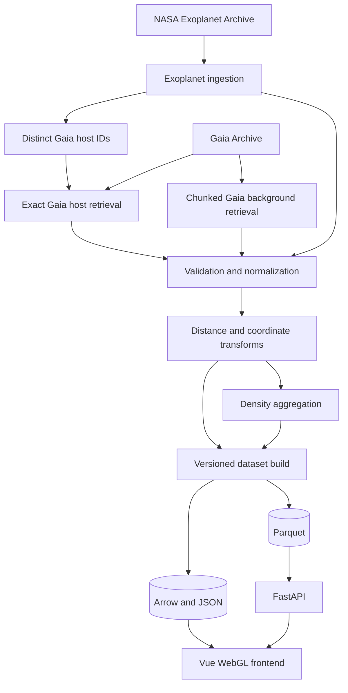
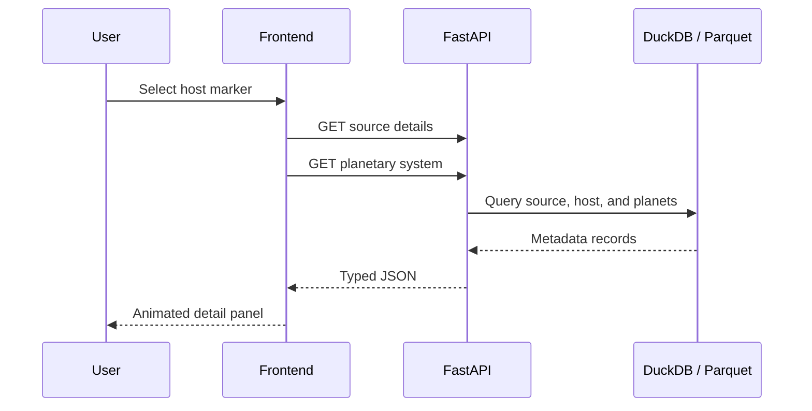

# Data Flow

## 1. Overview

The system separates upstream catalogue access, offline transformation, static publication, and runtime metadata queries.



## 2. Exoplanet-first ingestion

The first external dataset retrieved in a build is NASA `PSCompPars`.

### 2.1 Raw retrieval

The raw query response is stored without destructive modification.

The job records:

- source endpoint;
- table name;
- query text;
- request timestamp;
- file checksum;
- row count;
- schema snapshot.

### 2.2 Normalization

The raw planet rows are split into three logical entities.

#### Host

```text
host_id
hostname
hd_name
hip_name
gaia_dr3_id
ra
dec
system_distance_pc
stellar_temperature_k
stellar_mass_solar
stellar_radius_solar
stellar_luminosity_solar
```

#### System

```text
system_id
host_id
star_count
planet_count
system_distance_pc
```

#### Planet

```text
planet_id
system_id
planet_name
radius_earth
mass_earth
density
orbital_period_days
semi_major_axis_au
eccentricity
equilibrium_temperature_k
insolation_earth
discovery_method
discovery_year
```

### 2.3 Host Gaia-ID extraction

The pipeline extracts distinct, valid Gaia DR3 IDs.

```text
PSCompPars rows
    → normalize gaia_dr3_id
    → deduplicate by source_id
    → write gaia_host_ids.parquet
```

Hosts without Gaia IDs remain in the exoplanet dataset and may later be coordinate matched.

## 3. Exact Gaia host retrieval

The host-ID list is split into bounded batches.

```text
Batch 1: source IDs 1–N
Batch 2: source IDs N+1–2N
...
```

Each batch queries only the required Gaia columns.

The preferred match order is:

1. exact Gaia DR3 ID;
2. verified external identifier;
3. coordinate match with stored angular separation;
4. unmatched exoplanet host.

Every result records:

- match method;
- match confidence;
- Gaia release;
- source ID;
- source query batch ID.

## 4. Gaia background retrieval

The background pipeline does not need readable names or full source details.

Its purpose is to create density cells for the Milky Way overview.

### 4.1 Initial validation input

Use the already successful 10,000-source retrieval to validate:

- FITS/CSV parsing;
- null handling;
- distance selection;
- Galactocentric transforms;
- density binning;
- Arrow export;
- frontend appearance.

### 4.2 Production retrieval

Larger Gaia inputs are retrieved through multiple asynchronous jobs rather than one monolithic query.

Possible chunk keys:

- `random_index` intervals;
- `source_id` intervals;
- HEALPix/source-ID prefixes;
- bounded sky regions.

Each chunk is:

1. submitted asynchronously;
2. downloaded directly to a file;
3. validated;
4. transformed;
5. aggregated;
6. marked complete in a build journal.

The pipeline can resume without repeating successful chunks.

## 5. Validation flow

### Gaia validation

- `source_id` is present;
- coordinates are in valid ranges;
- required rendering values are numeric or null;
- parallax is not silently treated as distance;
- null and NaN values are normalized;
- duplicate source IDs are resolved deterministically;
- source classification and quality fields are preserved.

### Exoplanet validation

- planet and host names are non-empty;
- Gaia IDs are normalized consistently;
- physical quantities are non-negative where required;
- duplicate planet rows are resolved deterministically;
- host/system/planet relationships are valid.

## 6. Distance selection

The top-down views require distance estimates.

Recommended priority:

```text
1. Gaia GSP-Phot distance, when available and accepted
2. inverse positive parallax with configured quality criteria
3. unavailable
```

Every source stores:

```text
distance_pc
distance_lower_pc
distance_upper_pc
distance_method
distance_quality
```

No distance is fabricated for sources that do not meet an accepted method.

## 7. Coordinate transformation

### Heliocentric

Used by the exoplanet atlas.

```text
Sun = origin
x, y = Galactic plane
z = height from Galactic plane
```

### Galactocentric

Used by the Milky Way top-down view.

```text
Galactic centre = origin
Sun = explicit reference marker
```

Astropy performs the transformation. The selected Galactocentric parameter set is written to the dataset manifest.

## 8. Density aggregation

The Gaia background is converted into compact cells.

Example cell schema:

```text
grid_level
cell_x
cell_y
source_count
weighted_brightness
mean_bp_rp
mean_distance_quality
```

The pipeline may produce multiple resolutions:

```text
128 × 128
256 × 256
512 × 512
```

Only non-empty cells are exported.

## 9. Name selection

The initial name policy is:

```text
NASA hostname
    → HD name
    → HIP name
    → Gaia DR3 designation
```

Names are stored in a separate string table and referenced by integer index from the compact render file.

## 10. Build publication

A dataset build is published only after all mandatory validation checks pass.

```text
processed Parquet
    + frontend Arrow files
    + manifest JSON
    + checksums
    → atomic current-build switch
```

The last valid build remains active if a new build fails.

## 11. Runtime frontend flow

### Initial load


### Source selection



## 12. Cache policy

### Browser

- immutable Arrow files cached by build ID;
- selected details cached in memory;
- stale requests aborted;
- old GPU buffers released after view changes.

### Reverse proxy

- long cache lifetime for build-addressed static files;
- no-cache or short cache for `current/manifest.json`;
- compression enabled;
- range requests supported when useful.

### API

- source details may use moderate cache durations;
- search may use short cache durations;
- expensive arbitrary queries are not exposed publicly.

## 13. Failure handling

### Gaia query failure

- persist the Gaia job ID and error;
- retry with bounded backoff;
- reduce batch size if appropriate;
- do not discard successful chunks;
- do not publish a partial build as complete.

### Missing Gaia host record

- keep the exoplanet host;
- use archive coordinates when available;
- mark Gaia enrichment as unavailable;
- retain match status in metadata.

### Missing distance

- include the object in sky-based views;
- exclude it from top-down spatial views;
- disclose the reason.

### Deployment failure

- keep the prior application image and dataset build;
- fail the health check;
- roll back automatically or manually.
